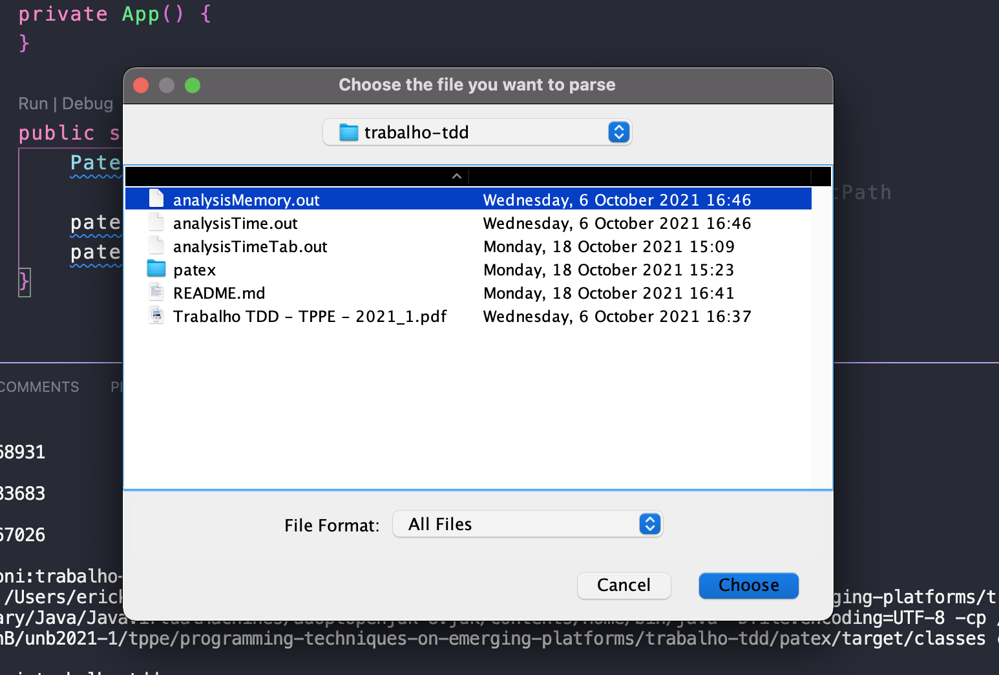
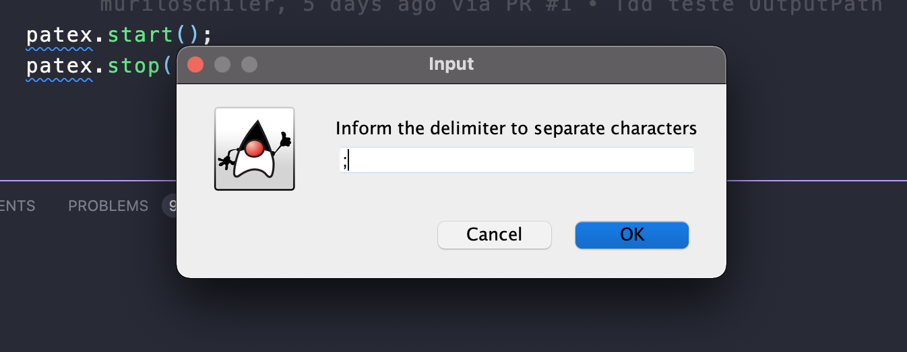
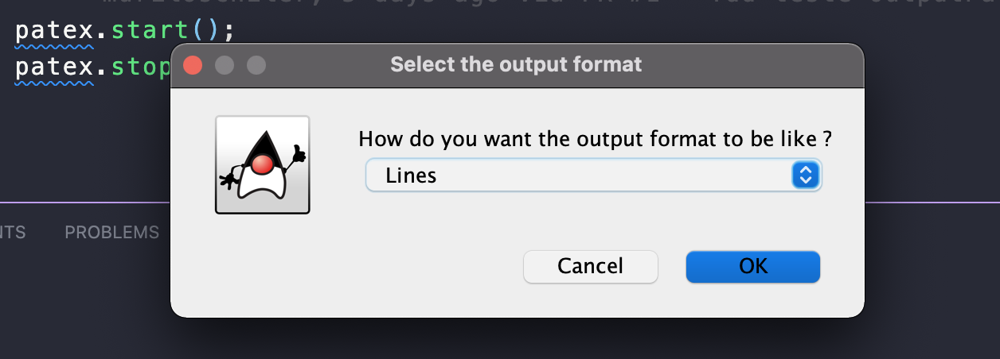
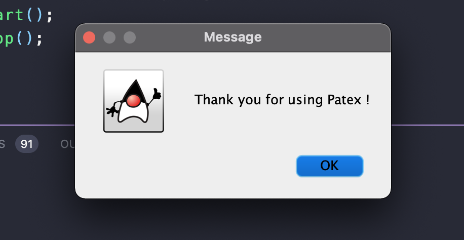

# Patex app

A aplicação **Patex** tem como objetivo fazer um *parse* de resultados de análises 
de confiabilidade em linhas de produto de *software*.

O ***pa**rser* de **tex**to (Patex) lê os valores anotados para cada evolução do 
software a partir de um arquivo de entrada. Então escreve num arquivo de saída os 
valores lidos, porém de modo formatado segundo um delimitador escolhido pelo usuário. 

Esse é o trabalho prático 1 da disciplina de Técnicas de Programação em Plataformas 
Emergentes, do curso de Engenharia de Software da Universdade de Brasília (UnB). 
O enunciado pode ser lido em "Trabalho TDD - TPPE - 2021_1.pdf". 

**Patex** foi desenvolvido seguindo o ***Test-Driven Development*** (TDD). 

**O grupo:**

- Erick Giffoni (170141161)
- Murilo Schiler (150142536)

**Screenshots:**

Tela inicial

Escolha do delimitador

Escolha do local de escrita do arquivo de saída

Escolha do formato de saída (linhas ou colunas)

Fim

